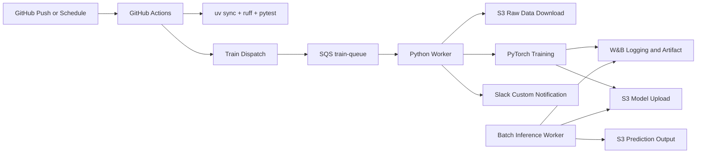

# TMDB Rating MLOps Pipeline

## 1. Project Overview

- 주제: TMDB 데이터를 활용한 영화 평점 예측 서비스 및 MLOps 파이프라인 구축
- 목표: 영화 메타데이터를 기반으로 평점을 예측하고, 학습/배포/모니터링을 자동화
- 프로젝트 기간: 2026-02-27 ~ 2026-03-13
- 코드 수정 가능 기간: 2026-02-27 ~ 2026-03-11 (의논 후 결정)
- 코드 프리즈: 2026-03-12(의논 후 결정)
- 최종 발표일: 2026-03-13
- 기술스택: Python, uv, PyTorch, AWS S3, AWS SQS, W&B, GitHub Actions, Slack Bot

## 2. Team Members

- [유준우 (팀장)](https://github.com/joonwoo-yoo)
- 문성호
- [서지은](https://github.com/jieunseo02)
- [송민성](https://github.com/alstjd0051)
- [송용단](https://github.com/totalintelli)
- [이재석](https://github.com/wotjrzm)

## 3. Pipeline Architecture



## 4. Quick Start (uv)

```bash
uv sync --dev
cp .env.example .env
```

## 5. GitHub Actions

- `ci.yml`: uv 기반 lint/test 실행 후 Slack 알림
- `train-dispatch.yml`: 수동/스케줄로 SQS 학습 메시지 전송 후 Slack 알림
- `notify.yml`: 재사용 가능한 Slack 커스텀 알림 워크플로우

## 6. 예측 API 서비스

영화 메타데이터(budget, runtime, popularity, vote_count)를 기반으로 평점을 예측하는 REST API입니다.

```bash
# API 서버 실행
uv run uvicorn src.api.main:app --host 0.0.0.0 --port 8000
```

- `GET /health` - 헬스체크
- `POST /predict` - 단일 영화 평점 예측
- `POST /predict/batch` - 배치 예측

예시:

```bash
curl -X POST http://localhost:8000/predict \
  -H "Content-Type: application/json" \
  -d '{"budget": 100000000, "runtime": 120, "popularity": 25.5, "vote_count": 5000}'
```

## 7. Docker 실행

```bash
# 1) 환경변수 준비
# .env

# 2) 이미지 빌드
docker compose build

# 3) 학습 워커 + API 서비스 실행
docker compose up -d

# 로그 확인
docker compose logs -f trainer-worker
docker compose logs -f api
```

개별 실행:

```bash
# 학습 워커
docker build -t mlops-trainer-worker:latest .
docker run --rm --env-file .env mlops-trainer-worker:latest

# API 서비스
docker run --rm -p 8000:8000 --env-file .env mlops-trainer-worker:latest \
  uv run uvicorn src.api.main:app --host 0.0.0.0 --port 8000
```

로컬 학습 워커 실행:

```bash
uv run python -m src.train.run_train
```

## 8. 원격 GPU 학습

GPU가 있는 원격 서버에서 학습을 실행하려면:

```bash
# 1) remote.env 설정 (연결 정보, GitHub에 업로드되지 않음)
cp remote.env.example remote.env
# remote.env 편집: REMOTE_HOST, REMOTE_PORT, SSH_KEY 등

# 2) 배포 스크립트 실행 (이미지 빌드 후 원격 전송)
./scripts/deploy_remote.sh

# 3) 스크립트 출력의 scp 명령으로 .env 복사

# 4) 원격 서버 SSH 접속 후 GPU 워커 실행
```

자세한 내용은 [docs/remote-gpu-training.md](docs/remote-gpu-training.md)를 참고하세요.

## 9. W&B Usage Guide

- 실험 추적: epoch별 `train_loss`, `val_rmse`
- 아티팩트: 학습 완료 모델 파일 업로드
- 모델 관리: `scripts/register_model.py`를 기반으로 팀 정책에 맞는 Registry 로직 추가
