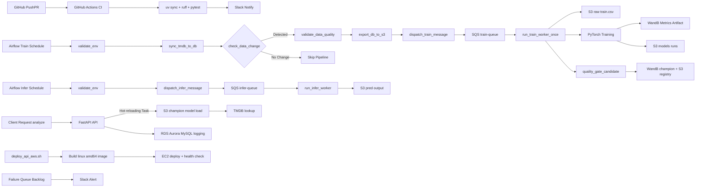

# TMDB Rating MLOps Pipeline

## 1. Project Overview

- 주제: 한국 영화 데이터를 활용한 영화 평점 예측 서비스 및 MLOps 파이프라인 구축
- 목표: 영화 메타데이터를 기반으로 평점을 예측하고, 학습/배포/모니터링을 자동화
- 프로젝트 기간: 2026-02-27 ~ 2026-03-13
- 코드 수정 가능 기간: 2026-02-27 ~ 2026-03-11 (의논 후 결정)
- 코드 프리즈: 2026-03-12(의논 후 결정)
- 최종 발표일: 2026-03-13
- 최대 작동일: 2026-03-15
- 기술스택: Python, uv, PyTorch, AWS S3, AWS SQS, W&B, GitHub Actions, Slack Bot, Docker, Airflow, Aurora and RDS

## 2. Team Members

- [유준우 (팀장)](https://github.com/joonwoo-yoo)
- [송민성](https://github.com/alstjd0051)
- [송용단](https://github.com/totalintelli)
- [이재석](https://github.com/wotjrzm)

### 기여도

| 팀원 (이름 + GitHub)                                           |                                                                                                     기여도 |
| -------------------------------------------------------------- | ---------------------------------------------------------------------------------------------------------: |
| [유준우 (팀장) (@joonwoo-yoo)](https://github.com/joonwoo-yoo) |  |
| [송민성 (@alstjd0051)](https://github.com/alstjd0051)          |  |
| [송용단 (@totalintelli)](https://github.com/totalintelli)      |   |
| [이재석 (@wotjrzm)](https://github.com/wotjrzm)                |   |

<!-- contribution-table:end -->

## 3. 업무 분담

### MLOps

- 이재석 님

### AI 모델링

- 유준우 님

### MLOps, AI 모델링 지원

- 송용단 님
- 송민성 님

## 4. 1차 마일스톤 (목표)

1. 영화 평점 예측 모델 만들기
2. 영화 평점 예측 결과를 저장할 DB 세팅
3. 웹 서버 세팅
4. 웹 사이트에 영화 평점 예측 결과 출력

## 5. Pipeline Architecture



### 현재 운영 Flow 정의

1. **CI Flow**
   - `push`/`pull_request` 발생 시 GitHub Actions가 `uv sync`, `ruff`, `pytest`를 수행합니다.
   - 결과는 Slack 알림 워크플로우와 연결되어 품질 게이트 상태를 공유합니다.

2. **학습 Flow (Airflow + SQS + Worker)**
   - `mlops_train_pipeline`가 `validate_env -> sync_tmdb_to_db -> check_data_change -> validate_data_quality -> export_db_to_s3 -> dispatch_train_message -> run_train_worker_once -> quality_gate_candidate` 순서로 실행됩니다.
   - `check_data_change`: DB의 현재 데이터 건수와 마지막 학습 시점의 건수를 비교해 변화가 없을 경우 파이프라인을 중지(Short-circuit)합니다.
   - `validate_data_quality`: 결측치 비율(10% 미만), 평점 유효 범위(0~10), 주요 필드 음수 값 존재 여부 등을 학습 데이터 레이크 적재 전 검증합니다.
   - SQS는 디스패치 경로를 유지하고, 실제 학습은 현재 DAG task 내부 워커(`run_train_worker_once`)에서 수행됩니다.
   - 학습 결과는 S3 모델 경로와 W&B에 기록되고, 품질 게이트 후 champion 포인터를 갱신합니다.

3. **배치 추론 Flow**
   - `mlops_infer_pipeline`가 `validate_env -> dispatch_infer_message`를 수행해 SQS `infer-queue`에 작업을 발행합니다.
   - 추론 워커가 큐를 소비해 S3 입력/모델을 사용해 배치 추론을 실행하고 결과를 S3 `pred`에 저장합니다.

4. **API 서비스 Flow**
   - `/analyze`, `/analyze/id` 요청이 들어오면 API가 모델을 로드해 예측을 계산하고 추천 결과를 반환합니다.
   - 요청/응답 메타 로그는 RDS/Aurora(MySQL 호환) 경로로 비차단 저장됩니다.

5. **AWS 배포 Flow**
   - `scripts/deploy_api_aws.sh`가 `linux/amd64` 이미지 빌드(또는 `SKIP_BUILD=true` 재사용) 후 EC2로 전송/기동하고 `/health`로 배포 검증합니다.

### 기술 스택 역할

- **Python, uv**: 의존성 관리 및 실행 환경 표준화. `uv sync`로 로컬/CI/Docker 환경 일관성 유지
- **PyTorch**: 모델 학습 엔진. 학습(`src/train/run_train.py`)과 추론(`src/infer/`) 코드 분리
- **AWS S3**: 데이터 레이크 및 모델 저장소. `raw/`, `models/`, `pred/` prefix로 단계별 데이터 관리
- **AWS SQS**: 학습/배치 추론 디스패치 큐. Airflow가 작업을 큐에 발행하고 워커가 소비하는 비동기 처리 구조
- **W&B**: 실험 추적 및 모델 거버넌스. metric, hyperparameter, artifact를 연결해 재현성 확보
- **GitHub Actions**: CI 자동화. 코드 품질 검사(`ruff`, `pytest`), Docker 이미지 빌드, 학습 파이프라인 트리거
- **Slack Bot**: 운영 가시성. 학습 실패, 큐 적체, 성능 저하 알림
- **Docker**: 실행 환경 고정. 학습 워커, 추론 워커, API 서비스 컨테이너화
- **Airflow**: 배치 파이프라인 오케스트레이터. DAG 기반 워크플로우 정의 및 스케줄 실행
- **RDS/Aurora**: 운영 메타데이터 및 서비스용 관계형 저장소. 예측 결과, 요청 상태, 배치 실행 메타 저장

## 6. Quick Start (uv)

```bash
uv sync --dev
cp .env.example .env
```

## 7. GitHub Actions / CI & CD

- `ci.yml`: `push/pull_request/workflow_dispatch`에서 `uv sync + ruff + pytest` 실행
- `cd-api-deploy.yml`: API 서비스의 EC2 배포 및 헬스체크 자동화
- `ci.yml`(수동 실행 시): `scripts/register_model.py`로 W&B 기반 최소 품질 게이트 확인
- `notify.yml`: 재사용 가능한 Slack 커스텀 알림 워크플로우
- `ec2-monitoring-daily.yml`: 매일 EC2 인스턴스 현황 집계 후 Slack 알림
- `ec2-scheduled-control.yml`: 평일 매시 실행으로 `config/ec2_schedule_targets.csv`의 role별 시작/중지 시간 정책 자동 적용
- `ec2-queue-autoscale.yml`: SQS backlog 기반 `role=train|infer` 워커 자동 시작/중지
- `ec2-anomaly-cost-alert.yml`: 10분 단위 이상 징후(고CPU/디스크 부족 위험/헬스체크 실패) 탐지 + 24시간 평균 CPU/Network/Disk 기준 저사용 후보 알림
- 스케줄 기반 워크플로우는 `2026-02-27` ~ `2026-03-15` 기간에서만 실행되도록 기간 가드 적용
- 비용 상한(3/15 누적 10만원) 운영을 위해 Repository Variables 기본값:
  - `TRAIN_QUEUE_SCALE_OUT_THRESHOLD=2`
  - `INFER_QUEUE_SCALE_OUT_THRESHOLD=5`
  - `QUEUE_SCALE_IN_IDLE_MINUTES=10`
  - `QUEUE_IDLE_CPU_THRESHOLD=2`

## 8. Airflow 오케스트레이션

### 현재 구현: 배치 파이프라인 중심

Airflow는 배치 워크플로우 오케스트레이션에 사용됩니다. 학습과 배치 추론을 SQS 큐를 통해 디스패치하는 구조입니다.

#### DAG 구성

**DAG 1: `mlops_train_pipeline.py`**

- **실제 흐름**: `validate_env` -> `sync_tmdb_to_db` -> `check_data_change` -> `validate_data_quality` -> `export_db_to_s3` -> `dispatch_train_message` -> `run_train_worker_once` -> `quality_gate_candidate`
- **스케줄**: 매일 UTC `02:00` (`0 2 * * *`)
- **실행 기간**: `2026-02-27` ~ `2026-03-15`
- **특징**: 
  - `check_data_change` 단계에서 데이터 변화가 없으면 이후 단계를 모두 Skip하여 컴퓨팅 리소스를 절약합니다.
  - `validate_data_quality` 단계에서 기준 미달 시 Slack 경보를 전송하고 파이프라인을 중단합니다.
  - DAG 내부에서 학습 워커를 직접 실행 (`run_train_worker_once`). SQS 메시지는 디스패치만 하고 실제 학습은 DAG task에서 수행

**DAG 2: `mlops_infer_pipeline.py`**

- **실제 흐름**: `validate_env` -> `dispatch_infer_message`
- **스케줄**: 매일 UTC `02:30` (`30 2 * * *`)
- **역할**: 배치 추론 메시지를 SQS `infer-queue`에 발행만 수행. 실제 추론 워커는 별도 프로세스가 큐에서 소비

**DAG 3: `mlops_train_then_infer_pipeline.py`**

- 수동 트리거로 학습 DAG 완료 후 추론 DAG 순차 실행
- 내부 순서: `trigger_train_pipeline` -> `trigger_infer_pipeline`

**DAG 4: `mlops_datasets_observer.py`**

- Dataset 이벤트 기반 관찰용 DAG

#### SQS 디스패치 전략

- **학습 큐**: `scripts/send_sqs_message.py`가 W&B 최근 성능 기준으로 best profile 선택 후 SQS에 전송 (조회 실패 시 baseline 폴백)
- **추론 큐**: `scripts/send_infer_sqs_message.py`가 배치 추론 메시지 발행
- **역할**: Airflow는 작업 디스패치만 담당하고, 실제 워커는 큐에서 메시지를 소비해 처리

#### 품질 게이트 및 모델 관리

- **품질 게이트**: `quality_gate_candidate` task는 기본적으로 비차단 모드(`QUALITY_GATE_REQUIRED=false`). 통과 run이 없어도 경고만 기록하고 DAG는 성공 처리
- **챔피언 전략**:
  - W&B: 품질 게이트 통과 run 중 최적 후보를 `champion` alias로 사용
  - S3: 모델 파일은 `models/runs/{run_id}/rating_model.pt` immutable 키 유지 + 버킷 Versioning 사용
  - 레지스트리: `scripts/register_model.py`가 `models/registry/champion.json` 포인터를 갱신하고, 추론은 이 포인터를 조회해 실제 모델 키를 결정

### 확장 전략 (향후 목표)

향후 더 세분화된 DAG 구조로 확장 가능:

- `daily_data_ingest` -> `data_validation` -> `feature_build` -> `train_model` -> `evaluate_model` -> `register_model` -> `batch_inference` -> `write_predictions_to_rds` -> `notify_slack`

## 9. 예측 API 서비스

클라이언트가 영화 제목을 입력하면 메타데이터를 조회해 평점을 예측하고,
해당 영화 기준의 유사 작품 추천을 반환하는 `/analyze` 단일 REST API입니다.

```bash
# API 서버 실행
uv run uvicorn src.api.main:app --host 0.0.0.0 --port 8000
```

- `GET /health` - 헬스체크
- `POST /analyze` - 영화 제목 기준 평점 + 추천 통합 응답
- `POST /analyze/id` - 영화 TMDB ID 기준 평점 + 추천 통합 응답

- 영화 미검색: `404` (`영화 검색 결과가 없습니다.`)
- 모델 미로드: `503` (`모델 파일을 찾을 수 없습니다...`)

#### Hot-reloading (CD)
- 백그라운드 태스크가 10분 간격으로 S3 레지스트리(`champion.json`)를 체크하여 신규 모델 버전이 감지되면 서비스 재시작 없이 즉시 메모리에 로드합니다.

## 10. Docker 실행

```bash
# 1) 환경변수 준비
# .env

# 2) 이미지 빌드
docker compose build

# 3) 학습/추론 워커 + API 서비스 실행
docker compose up -d

# 로그 확인
docker compose logs -f trainer-worker
docker compose logs -f infer-worker
docker compose logs -f api
```

개별 실행:

```bash
# 학습 워커
docker build -t mlops-trainer-worker:latest .
docker run --rm --env-file .env mlops-trainer-worker:latest

# API 서비스
docker run --rm -p 8000:8000 --env-file .env mlops-trainer-worker:latest \
  uv run uvicorn src.api.main:app --host 0.0.0.0 --port 8000
```

로컬 학습 워커 실행:

```bash
uv run python -m src.train.run_train
```

## 11. 모델 학습 정의

- **학습 목표**: TMDB 한국 영화 메타데이터로 `vote_average`를 회귀 예측
- **학습 데이터 범위**: `original_language == "ko"` 조건을 만족하는 영화만 사용
- **입력 피처**: `budget`, `runtime`, `popularity`, `vote_count`
- **타깃 라벨**: `vote_average`
- **모델 구조**: PyTorch `RatingRegressor` (MLP, BatchNorm, Dropout 포함)
- **전처리**: `StandardScaler`를 학습 데이터에 fit, 검증/추론에 동일 transform 적용
- **손실 함수**: `MSELoss`
- **평가 지표**:
  - `val_rmse`: 검증 RMSE
  - `val_out_of_range_ratio`: 예측값이 0~10 범위를 벗어나는 비율
- **체크포인트 저장 전략**: 마지막 epoch가 아니라 `best val_rmse`(동률 시 out-of-range 비율이 더 낮은 값) 기준 모델을 저장
- **학습 아티팩트 저장 형식**:
  - `model_state_dict`
  - `feature_cols`, `target_col`
  - `hidden_dims`, `dropout`
  - `scaler_mean`, `scaler_scale`, `scaler_var`
  - `best_epoch`, `best_val_rmse`, `best_val_out_of_range_ratio`
- **추론 안정화**: 최종 예측값은 0~10 범위로 clamp 처리

## 12. W&B Usage Guide

- 실험 추적: epoch별 `train_loss`, `val_rmse`
- 실험 추적(권장): `val_out_of_range_ratio`도 함께 모니터링
- 실험 config: `tuning_profile`, `learning_rate`, `hidden_dims`, `dropout`, `epochs`, `batch_size`, `seed`
- 아티팩트: 학습 완료 모델 파일 업로드
- 모델 관리(MVP): `scripts/register_model.py`가 품질 게이트를 통과한 run 중 최적 후보를 선별해
  W&B `champion` 태그 기준 메타데이터를 `models/registry/champion.json`에 기록하고
  `artifacts/model_registry_candidate.json`를 생성
- 비차단 품질 게이트: `QUALITY_GATE_REQUIRED=false`인 경우 통과 run이 없어도 경고 로그만 남기고 종료

품질 게이트 기본값:

- `QUALITY_GATE_VAL_RMSE_MAX=1.2`
- `QUALITY_GATE_OUT_OF_RANGE_MAX=0.05`

## 13. 데이터/라벨 규칙

- 한국 데이터만 사용: `original_language == "ko"`
- 기본 타깃 라벨: `vote_average`
- 기본 피처: `budget`, `runtime`, `popularity`, `vote_count`

## 14. Database Infrastructure

### 전략: RDS/Aurora 우선, 로컬 MySQL은 개발/대체 경로

운영 환경에서는 **RDS MySQL 또는 Aurora MySQL**을 우선 사용하고, 로컬 개발/테스트 환경에서는 Docker 기반 MySQL을 fallback으로 사용합니다.

### 1) DB 연결 우선순위

`src/config.py`의 연결 우선순위:

1. **`DB_*` 변수** (RDS/Aurora 엔드포인트): 운영 환경에서 Terraform output으로 설정
2. **`MYSQL_*` 변수** (로컬/레거시): 개발 환경 fallback
3. **기본값**: `localhost:3306`, `mlops/mlops1234`

```python
# 우선순위: DB_HOST (RDS/Aurora) > MYSQL_HOST (로컬) > localhost
db_host = settings.get_db_host()  # RDS/Aurora 엔드포인트 우선
```

### 2) 운영 환경 설정 (RDS/Aurora)

Terraform으로 RDS/Aurora를 생성한 경우:

```bash
# Terraform output으로 엔드포인트 확인
terraform output -raw rds_mysql_endpoint
# 또는
terraform output -raw aurora_mysql_endpoint

# .env에 설정
DB_HOST=<rds_or_aurora_endpoint>
DB_PORT=3306
DB_USER=<db_user>
DB_PASSWORD=<db_password>
DB_NAME=mlops
```

### 3) 로컬 개발 환경 설정 (Docker MySQL)

로컬 개발 시 Docker 기반 MySQL 사용:

```bash
# DB 서비스 실행
docker compose up -d db

# .env 설정 (로컬)
DB_HOST=localhost  # 또는 db (컨테이너 간 통신)
DB_PORT=3306
DB_USER=<개인 설정>
DB_PASSWORD=<개인 설정>
DB_NAME=mlops
DB_AUTO_FAILOVER=true
DB_FALLBACK_HOSTS=db,localhost,127.0.0.1,host.docker.internal
```

### 4) 주요 설정

- **Engine**: MySQL 8.4 LTS (RDS/Aurora 호환)
- **Character Set**: `utf8mb4` (한글 및 이모지 지원)
- **Timezone**: `Asia/Seoul`
- **Initial Schema**: `database/scripts/01_schema.sql`, `03_analyze_id_prediction_logs.sql` (컨테이너 실행 시 자동 로드)

### 5) 데이터베이스 스키마 구조

- `movies_raw`: TMDB API에서 수집한 한국 영화(`ko`) 원천 데이터
- `prediction_logs` / `analyze_id_prediction_logs`: 모델 버전별 영화 평점 예측 이력 관리

### 6) Database Schema (`movies_raw` table)

| Column         | Type     | Description                        |
| :------------- | :------- | :--------------------------------- |
| `tmdb_id`      | INT (PK) | TMDB 고유 ID (학습 시 `id`로 매핑) |
| `title`        | VARCHAR  | 영화 제목                          |
| `budget`       | INT      | 영화 제작비                        |
| `runtime`      | INT      | 상영 시간                          |
| `popularity`   | FLOAT    | 인기도                             |
| `vote_average` | FLOAT    | 실제 평점 (Target Variable)        |
| `vote_count`   | INT      | 투표 수                            |
| `genres`       | JSON     | 장르 ID 리스트                     |

### 7) Data Ingestion (Crawler)

- **Source**: TMDB API (`discover/movie`)
- **Filter**: `region=KR`, `original_language=ko`
- **Logic**: 수집된 데이터는 `ON DUPLICATE KEY UPDATE` 방식을 통해 중복 없이 최신 상태로 유지
- **Trigger**: 현재 DB 건수가 목표치(`MAX_PAGE` × 20)에 단 1개라도 미달할 경우 즉시 수집기 가동

### 8) 모델 학습 (Main Pipeline)

- 데이터 소스를 로컬 CSV에서 **RDS/Aurora 또는 로컬 MySQL DB**로 전환
- 실행 시 DB 데이터를 우선 조회하며, 데이터가 없을 경우에만 자동 수집 진행

### 9) DB 확인

```bash
# 로컬 MySQL 확인
docker exec -it mlops mysql -u <DB_USER> -p mlops -e "SELECT COUNT(*) AS total_movies FROM movies_raw;"

# RDS/Aurora 확인 (로컬에서)
mysql -h <DB_HOST> -u <DB_USER> -p mlops -e "SELECT COUNT(*) AS total_movies FROM movies_raw;"
```
