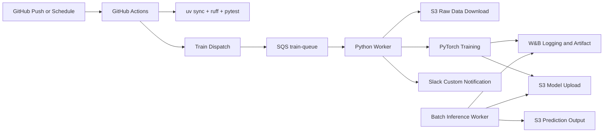

# TMDB Rating MLOps Pipeline

## 1. Project Overview

- 주제: TMDB 데이터를 활용한 영화 평점 예측 서비스 및 MLOps 파이프라인 구축
- 목표: 영화 메타데이터를 기반으로 평점을 예측하고, 학습/배포/모니터링을 자동화
- 기술스택: Python, uv, PyTorch, AWS S3, AWS SQS, W&B, GitHub Actions, Slack Bot

## 2. Team Members

- [유준우 (팀장)](https://github.com/joonwoo-yoo)
- 문성호
- [서지은](https://github.com/jieunseo02)
- [송민성](https://github.com/alstjd0051)
- 송용단
- [이재석](https://github.com/wotjrzm)

## 3. Pipeline Architecture



## 4. Quick Start (uv)

```bash
uv sync --dev
cp .env.example .env
```

## 5. GitHub Actions

- `ci.yml`: `uv` 기반 lint/test 실행 후 Slack 알림
- `train-dispatch.yml`: 수동/스케줄로 SQS 학습 메시지 전송 후 Slack 알림
- `notify.yml`: 재사용 가능한 Slack 커스텀 알림 워크플로우

## 6. Docker 실행

```bash
# 1) 환경변수 준비
# .env

# 2) 이미지 빌드
docker compose build

# 3) 학습 워커 실행 (SQS 메시지 포함)
docker compose up -d

# 로그 확인
docker compose logs -f trainer-worker
```

개별 실행:

```bash
docker build -t mlops-trainer-worker:latest .
docker run --rm --env-file .env mlops-trainer-worker:latest
```

## 7. W&B Usage Guide

- 실험 추적: epoch별 `train_loss`, `val_rmse`
- 아티팩트: 학습 완료 모델 파일 업로드
- 모델 관리: `scripts/register_model.py`를 기반으로 팀 정책에 맞는 Registry 승격 로직 추가
