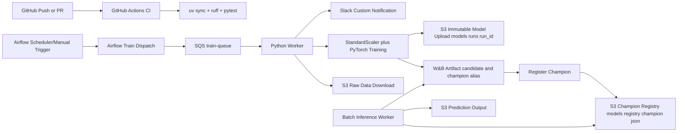
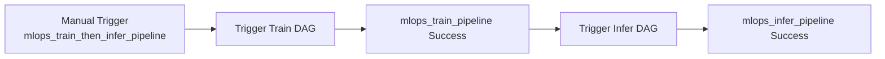

# TMDB Rating MLOps Pipeline

## 1. Project Overview

- 주제: 한국 영화 데이터를 활용한 영화 평점 예측 서비스 및 MLOps 파이프라인 구축
- 목표: 영화 메타데이터를 기반으로 평점을 예측하고, 학습/배포/모니터링을 자동화
- 프로젝트 기간: 2026-02-27 ~ 2026-03-13
- 코드 수정 가능 기간: 2026-02-27 ~ 2026-03-11 (의논 후 결정)
- 코드 프리즈: 2026-03-12(의논 후 결정)
- 최종 발표일: 2026-03-13
- 최대 작동일: 2026-03-15
- 기술스택: Python, uv, PyTorch, AWS S3, AWS SQS, W&B, GitHub Actions, Slack Bot, Docker, Airflow, Aurora and RDS

## 2. Team Members

- [유준우 (팀장)](https://github.com/joonwoo-yoo)
- [송민성](https://github.com/alstjd0051)
- ~~[문성호](https://github.com/Eclipse-Universe)~~
- [송용단](https://github.com/totalintelli)
- [이재석](https://github.com/wotjrzm)

### 기여도

| 팀원 (이름 + GitHub)                                              |                                                                                                     기여도 |
| ----------------------------------------------------------------- | ---------------------------------------------------------------------------------------------------------: |
| [유준우 (팀장) (@joonwoo-yoo)](https://github.com/joonwoo-yoo)    |  |
| [송민성 (@alstjd0051)](https://github.com/alstjd0051)             |  |
| [문성호 (@Eclipse-Universe)](https://github.com/Eclipse-Universe) |   |
| [송용단 (@totalintelli)](https://github.com/totalintelli)         |   |
| [이재석 (@wotjrzm)](https://github.com/wotjrzm)                   |   |

<!-- contribution-table:end -->

## 3. 업무 분담

### MLOps

- 이재석 님

### AI 모델링

- 유준우 님

### MLOps, AI 모델링 지원

- ~~문성호 님~~ => 참여 부진
- 송용단 님
- 송민성 님

## 4. 1차 마일스톤 (목표)

1. 영화 평점 예측 모델 만들기
2. 영화 평점 예측 결과를 저장할 DB 세팅
3. 웹 서버 세팅
4. 웹 사이트에 영화 평점 예측 결과 출력

## 5. Pipeline Architecture



## 6. Quick Start (uv)

```bash
uv sync --dev
cp .env.example .env
```

## 7. GitHub Actions

- `ci.yml`: `push/pull_request/workflow_dispatch`에서 `uv sync + ruff + pytest` 실행
- `ci.yml`(수동 실행 시): `scripts/register_model.py`로 W&B 기반 최소 품질 게이트 확인
- `notify.yml`: 재사용 가능한 Slack 커스텀 알림 워크플로우
- `ec2-monitoring-daily.yml`: 매일 EC2 인스턴스 현황 집계 후 Slack 알림
- `ec2-scheduled-control.yml`: 평일 매시 실행으로 `config/ec2_schedule_targets.csv`의 role별 시작/중지 시간 정책 자동 적용
- `ec2-queue-autoscale.yml`: SQS backlog 기반 `role=train|infer` 워커 자동 시작/중지
- `ec2-anomaly-cost-alert.yml`: 10분 단위 이상 징후(고CPU/디스크 부족 위험/헬스체크 실패) 탐지 + 24시간 평균 CPU/Network/Disk 기준 저사용 후보 알림
- 스케줄 기반 워크플로우는 `2026-02-27` ~ `2026-03-15` 기간에서만 실행되도록 기간 가드 적용
- 비용 상한(3/15 누적 10만원) 운영을 위해 Repository Variables 기본값:
  - `TRAIN_QUEUE_SCALE_OUT_THRESHOLD=2`
  - `INFER_QUEUE_SCALE_OUT_THRESHOLD=5`
  - `QUEUE_SCALE_IN_IDLE_MINUTES=10`
  - `QUEUE_IDLE_CPU_THRESHOLD=2`

## 8. Airflow 오케스트레이션

- DAG 1: `airflow/dags/mlops_train_pipeline.py`
  - `validate_env` -> `dispatch_train_message` -> `run_train_worker_once` -> `quality_gate_candidate`
  - 스케줄: 매일 UTC `02:00` (`0 2 * * *`)
  - 실행 기간: `2026-02-27` ~ `2026-03-15` (`start_date`/`end_date` 고정)
  - 학습 워커가 별도 상시 실행되지 않아도 DAG 내부에서 1회 학습을 직접 수행
- DAG 2: `airflow/dags/mlops_infer_pipeline.py`
  - `validate_env` -> `dispatch_infer_message`
  - 스케줄: 매일 UTC `02:30` (`30 2 * * *`)
  - 실행 기간: `2026-02-27` ~ `2026-03-15` (`start_date`/`end_date` 고정)
- DAG 3: `airflow/dags/mlops_train_then_infer_pipeline.py`
  - 수동 1회 트리거로 `학습 DAG` 완료 후 `추론 DAG`를 순차 실행
  - 내부 순서: `trigger_train_pipeline` -> `trigger_infer_pipeline`
- DAG 4: `airflow/dags/mlops_datasets_observer.py`
  - Dataset 이벤트 기반 관찰용 DAG
- 원클릭 순차 실행 흐름:



- 역할: Airflow가 SQS 학습/배치추론 트리거를 오케스트레이션
- 학습 메시지 전략: `scripts/send_sqs_message.py`가 W&B의 최근 성능 기준으로 best profile 1건을 선택해 SQS에 전송 (조회 실패 시 baseline 폴백)
- 품질 게이트 정책: Airflow DAG의 `quality_gate_candidate`는 기본적으로 비차단 모드(`QUALITY_GATE_REQUIRED=false`)로 경고만 기록하고 DAG는 성공 처리
- 챔피언 전략:
  - W&B: 품질 게이트 통과 run 중 최적 후보를 `champion` alias로 사용
  - S3: 모델 파일은 `models/runs/{run_id}/rating_model.pt` immutable 키 유지 + 버킷 Versioning 사용
  - 레지스트리: `scripts/register_model.py`가 `models/registry/champion.json` 포인터를 갱신하고, 추론은 이 포인터를 조회해 실제 모델 키를 결정

## 9. 예측 API 서비스

클라이언트가 영화 제목을 입력하면 메타데이터를 조회해 평점을 예측하고,
해당 영화 기준의 유사 작품 추천을 반환하는 `/analyze` 단일 REST API입니다.

```bash
# API 서버 실행
uv run uvicorn src.api.main:app --host 0.0.0.0 --port 8000
```

- `GET /health` - 헬스체크
- `POST /analyze` - 영화 제목 기준 평점 + 추천 통합 응답
- `POST /analyze/id` - 영화 TMDB ID 기준 평점 + 추천 통합 응답

- 영화 미검색: `404` (`영화 검색 결과가 없습니다.`)
- 모델 미로드: `503` (`모델 파일을 찾을 수 없습니다...`)

## 10. Docker 실행

```bash
# 1) 환경변수 준비
# .env

# 2) 이미지 빌드
docker compose build

# 3) 학습/추론 워커 + API 서비스 실행
docker compose up -d

# 로그 확인
docker compose logs -f trainer-worker
docker compose logs -f infer-worker
docker compose logs -f api
```

개별 실행:

```bash
# 학습 워커
docker build -t mlops-trainer-worker:latest .
docker run --rm --env-file .env mlops-trainer-worker:latest

# API 서비스
docker run --rm -p 8000:8000 --env-file .env mlops-trainer-worker:latest \
  uv run uvicorn src.api.main:app --host 0.0.0.0 --port 8000
```

로컬 학습 워커 실행:

```bash
uv run python -m src.train.run_train
```

## 11. 모델 학습 정의

- **학습 목표**: TMDB 한국 영화 메타데이터로 `vote_average`를 회귀 예측
- **학습 데이터 범위**: `original_language == "ko"` 조건을 만족하는 영화만 사용
- **입력 피처**: `budget`, `runtime`, `popularity`, `vote_count`
- **타깃 라벨**: `vote_average`
- **모델 구조**: PyTorch `RatingRegressor` (MLP, BatchNorm, Dropout 포함)
- **전처리**: `StandardScaler`를 학습 데이터에 fit, 검증/추론에 동일 transform 적용
- **손실 함수**: `MSELoss`
- **평가 지표**:
  - `val_rmse`: 검증 RMSE
  - `val_out_of_range_ratio`: 예측값이 0~10 범위를 벗어나는 비율
- **체크포인트 저장 전략**: 마지막 epoch가 아니라 `best val_rmse`(동률 시 out-of-range 비율이 더 낮은 값) 기준 모델을 저장
- **학습 아티팩트 저장 형식**:
  - `model_state_dict`
  - `feature_cols`, `target_col`
  - `hidden_dims`, `dropout`
  - `scaler_mean`, `scaler_scale`, `scaler_var`
  - `best_epoch`, `best_val_rmse`, `best_val_out_of_range_ratio`
- **추론 안정화**: 최종 예측값은 0~10 범위로 clamp 처리

## 12. W&B Usage Guide

- 실험 추적: epoch별 `train_loss`, `val_rmse`
- 실험 추적(권장): `val_out_of_range_ratio`도 함께 모니터링
- 실험 config: `tuning_profile`, `learning_rate`, `hidden_dims`, `dropout`, `epochs`, `batch_size`, `seed`
- 아티팩트: 학습 완료 모델 파일 업로드
- 모델 관리(MVP): `scripts/register_model.py`가 품질 게이트를 통과한 run 중 최적 후보를 선별해
  W&B `champion` 태그 기준 메타데이터를 `models/registry/champion.json`에 기록하고
  `artifacts/model_registry_candidate.json`를 생성
- 비차단 품질 게이트: `QUALITY_GATE_REQUIRED=false`인 경우 통과 run이 없어도 경고 로그만 남기고 종료

품질 게이트 기본값:

- `QUALITY_GATE_VAL_RMSE_MAX=1.2`
- `QUALITY_GATE_OUT_OF_RANGE_MAX=0.05`

## 13. 데이터/라벨 규칙

- 한국 데이터만 사용: `original_language == "ko"`
- 기본 타깃 라벨: `vote_average`
- 기본 피처: `budget`, `runtime`, `popularity`, `vote_count`

## 14. Database Infrastructure (MySQL 8.4 LTS)

- TMDB 한국 영화 원천 데이터 적재 및 예측 로그 관리를 위해 Docker 기반의 MySQL을 사용

### 1) 주요 설정

- **Engine**: MySQL 8.4 LTS
- **Character Set**: `utf8mb4` (한글 및 이모지 지원)
- **Timezone**: `Asia/Seoul`
- **Initial Schema**: `database/scripts/01_schema.sql`, `03_analyze_id_prediction_logs.sql` (컨테이너 실행 시 자동 로드)

### 2) 데이터베이스 스키마 구조

- `movies_raw`: TMDB API에서 수집한 한국 영화(`ko`) 원천 데이터
- `prediction_logs`: 모델 버전별 영화 평점 예측 이력 관리

### 3) 환경 변수 설정 (Local 실행 시 필수)

프로젝트 루트에 아래 두 파일이 있어야 DB 컨테이너가 정상 작동

- `.env`: `DB_NAME`, `DB_ROOT_PASSWORD`, `DB_USER`, `DB_PASSWORD`, `DB_HOST`, `DB_PORT` 설정
- DB_NAME=movie_prediction_db
- DB_ROOT_PASSWORD=admin
- DB_USER=[각자 설정] --> 개인 개발 단계에서는 각자 설정하고 배포/서버 단계에서는 통일
- DB_PASSWORD=[각자 설정]
- DB_HOST=localhost **(로컬에서 실행시)**
- DB_HOST=db **(컨테이너에서 실행시)**
- DB_PORT=3306

### 4) 실행 및 검증 (Common Docker Environment)

```bash
# DB 서비스 실행
docker compose up -d db

# 실행 상태 및 포트 매핑 확인 (3306 포트 점유 여부)
docker ps --filter "name=movie_prediction_db"

# 스키마 적용 로그 확인
docker logs -f movie_prediction_db
```

### 5) Data Ingestion (Crawler)

- **Source**: TMDB API (`discover/movie`)
- **Filter**: `region=KR`, `original_language=ko`
- **Logic**: 수집된 데이터는 `ON DUPLICATE KEY UPDATE` 방식을 통해 중복 없이 최신 상태로 유지
- **Trigger**: 현재 DB 건수가 목표치(`MAX_PAGE` × 20)에 단 1개라도 미달할 경우 즉시 수집기 가동 (`Strict Data Integrity`)

### 6) 모델 학습 (Main Pipeline)

- 데이터 소스를 로컬 CSV에서 **MySQL DB**로 전환
- 실행 시 DB 데이터를 우선 조회하며, 데이터가 없을 경우에만 자동 수집 진행

### 7) Database Schema (`movies_raw` table)

| Column         | Type     | Description                        |
| :------------- | :------- | :--------------------------------- |
| `tmdb_id`      | INT (PK) | TMDB 고유 ID (학습 시 `id`로 매핑) |
| `title`        | VARCHAR  | 영화 제목                          |
| **`budget`**   | INT      | **[신규]** 영화 제작비             |
| **`runtime`**  | INT      | **[신규]** 상영 시간               |
| `popularity`   | FLOAT    | 인기도                             |
| `vote_average` | FLOAT    | 실제 평점 (Target Variable)        |
| `vote_count`   | INT      | 투표 수                            |
| `genres`       | JSON     | 장르 ID 리스트                     |

### 8) MySQL DB 확인용 (현재 약 5,000개의 영화정보 저장)

```bash
# 프롬프트 창 입력
docker exec -it movie_prediction_db mysql -u [각자 설정한 DB_USER] -p movie_prediction_db -e "SELECT COUNT(*) AS total_movies FROM movies_raw;"
```
