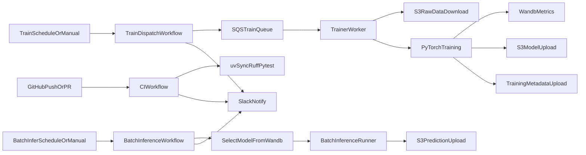

# TMDB Rating MLOps Pipeline

## 1. Project Overview

- 주제: TMDB 데이터를 활용한 영화 평점 예측 서비스 및 MLOps 파이프라인 구축
- 목표: 영화 메타데이터를 기반으로 평점을 예측하고, 학습/배포/모니터링을 자동화
- 프로젝트 기간: 2026-02-27 ~ 2026-03-13
- 코드 수정 가능 기간: 2026-02-27 ~ 2026-03-11 (의논 후 결정)
- 코드 프리즈: 2026-03-12(의논 후 결정)
- 최종 발표일: 2026-03-13
- 기술스택: Python, uv, PyTorch, AWS S3, AWS SQS, W&B, GitHub Actions, Slack Bot

## 2. Team Members

- [유준우 (팀장)](https://github.com/joonwoo-yoo)
- 문성호
- [서지은](https://github.com/jieunseo02)
- [송민성](https://github.com/alstjd0051)
- [송용단](https://github.com/totalintelli)
- [이재석](https://github.com/wotjrzm)

## 3. Pipeline Architecture



## 4. Quick Start (uv)

```bash
uv sync --dev
cp .env.example .env
```

## 5. GitHub Actions

- `ci.yml`: uv 기반 lint/test 실행 후 Slack 알림
- `train-dispatch.yml`: 수동/스케줄로 SQS 학습 메시지 전송 후 Slack 알림
- `batch-infer.yml`: W&B에서 배치 추론 대상 모델 자동 선택 후 S3 예측 결과 생성
- `notify.yml`: 재사용 가능한 Slack 커스텀 알림 워크플로우

## 6. 학습 실행

```bash
# 로컬 학습 워커 실행
uv run python -m src.train.run_train
```

학습 결과:

- 모델 파일: `s3://<AWS_S3_MODEL_BUCKET>/models/{run_id}/rating_model.pt`
- 메타데이터: `s3://<AWS_S3_MODEL_BUCKET>/models/{run_id}/training_metadata.json`
- W&B summary: `model_uri`, `val_rmse`, `feature_cols`, `metadata_uri`

## 7. 배치 추론 실행

```bash
# 배치 추론 CLI 실행
uv run python -m src.infer.run_batch_infer \
  --model-s3-key models/<run_id>/rating_model.pt \
  --input-s3-key tmdb/latest/train.csv \
  --output-s3-key predictions/tmdb/local/predictions.csv \
  --feature-cols budget,runtime,popularity,vote_count
```

GitHub Actions 자동화:

- `batch-infer.yml`을 수동 실행하거나 스케줄에 따라 실행
- 워크플로우가 최신 성능 모델을 W&B에서 선택하고, S3에 예측 결과를 저장

## 8. Docker 실행

```bash
# 1) 환경변수 준비
# .env

# 2) 이미지 빌드
docker compose build

# 3) 학습 워커 실행
docker compose run --rm trainer-worker
```

개별 실행:

```bash
docker build -t mlops-trainer-worker:latest .
docker run --rm --env-file .env mlops-trainer-worker:latest
```

## 9. 원격 GPU 학습

GPU가 있는 원격 서버에서 학습을 실행하려면:

```bash
# 1) remote.env 설정 (연결 정보, GitHub에 업로드되지 않음)
cp remote.env.example remote.env
# remote.env 편집: REMOTE_HOST, REMOTE_PORT, SSH_KEY 등

# 2) 배포 스크립트 실행 (이미지 빌드 후 원격 전송)
./scripts/deploy_remote.sh

# 3) 스크립트 출력의 scp 명령으로 .env 복사

# 4) 원격 서버 SSH 접속 후 GPU 워커 실행
```

자세한 내용은 [docs/remote-gpu-training.md](docs/remote-gpu-training.md)를 참고하세요.

## 10. W&B Usage Guide

- 실험 추적: epoch별 `train_loss`, `val_rmse`
- 아티팩트: 학습 완료 모델 파일 및 메타데이터 업로드
- 모델 선택: `uv run python scripts/register_model.py --output-json selected_model.json`

## 11. 향후 확장

- REST API 서빙(`src/api`)은 현재 저장소에 미구현 상태이며, 배치 추론 자동화 이후 단계로 분리 운영
