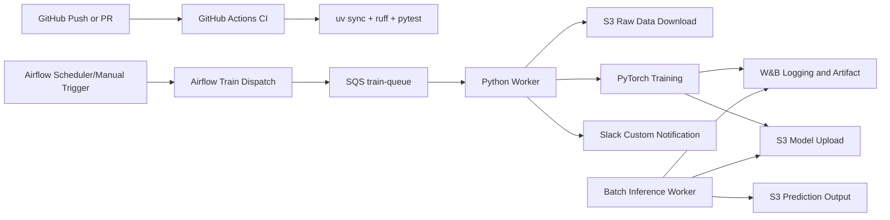
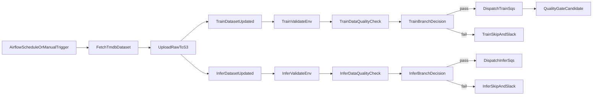

# TMDB Rating MLOps Pipeline

## 1. Project Overview

- 주제: 한국 영화 데이터를 활용한 영화 평점 예측 서비스 및 MLOps 파이프라인 구축
- 목표: 영화 메타데이터를 기반으로 평점을 예측하고, 학습/배포/모니터링을 자동화
- 프로젝트 기간: 2026-02-27 ~ 2026-03-13
- 코드 수정 가능 기간: 2026-02-27 ~ 2026-03-11 (의논 후 결정)
- 코드 프리즈: 2026-03-12(의논 후 결정)
- 최종 발표일: 2026-03-13
- 기술스택: Python, uv, PyTorch, AWS S3, AWS SQS, W&B, GitHub Actions, Slack Bot, Docker, Airflow

## 2. Team Members

- [유준우 (팀장)](https://github.com/joonwoo-yoo)
- [문성호](https://github.com/Eclipse-Universe)
- [송민성](https://github.com/alstjd0051)
- [송용단](https://github.com/totalintelli)
- [이재석](https://github.com/wotjrzm)

## 3. 업무 분담

### MLOps

- 이재석 님

### AI 모델링

- 유준우 님

### MLOps, AI 모델링 지원

- 문성호 님
- 송용단 님
- 송민성 님

## 4. 1차 마일스톤 (목표)

1. 영화 평점 예측 모델 만들기
2. 영화 평점 예측 결과를 저장할 DB 세팅
3. 웹 서버 세팅
4. 웹 사이트에 영화 평점 예측 결과 출력

## 5. Pipeline Architecture



## 6. Quick Start (uv)

```bash
uv sync --dev
cp .env.example .env
```

## 7. GitHub Actions

- `ci.yml`: `push/pull_request/workflow_dispatch`에서 `uv sync + ruff + pytest` 실행
- `ci.yml`(수동 실행 시): `scripts/register_model.py`로 W&B 기반 최소 품질 게이트 확인
- `notify.yml`: 재사용 가능한 Slack 커스텀 알림 워크플로우
- `ec2-monitoring-daily.yml`: 매일 EC2 인스턴스 현황 집계 후 Slack 알림
- `ec2-scheduled-control.yml`: 평일 매시 실행으로 `config/ec2_schedule_targets.csv`의 role별 시작/중지 시간 정책 자동 적용
- `ec2-queue-autoscale.yml`: SQS backlog 기반 `role=train|infer` 워커 자동 시작/중지
- `ec2-anomaly-cost-alert.yml`: 10분 단위 이상 징후(고CPU/디스크 부족 위험/헬스체크 실패) 탐지 + 24시간 평균 CPU/Network/Disk 기준 저사용 후보 알림
- 스케줄 기반 워크플로우는 `2026-02-27` ~ `2026-03-11` 기간에서만 실행되도록 기간 가드 적용

## 8. Airflow 오케스트레이션

- DAG 1: `airflow/dags/tmdb_dataset_ingest_pipeline.py`
  - `validate_env` -> `fetch_and_upload_tmdb_dataset`
  - 스케줄: 매일 UTC `01:00` (`0 1 * * *`)
  - 역할: TMDB API에서 한국 영화 데이터를 수집해 S3 raw(`train/infer`)에 업로드하고 Airflow Dataset 이벤트 발행
- DAG 2: `airflow/dags/mlops_train_pipeline.py`
  - `validate_env` -> `branch_data_quality` -> (`dispatch_train_message` 또는 `skip_dispatch`) -> `quality_gate_candidate`
  - 실행 트리거: `AIRFLOW_TRAIN_DATASET_URI` Dataset 이벤트(기본값: `s3://<AWS_S3_RAW_BUCKET>/tmdb/latest/train.csv`)
  - 역할: 데이터 품질(객체 존재/용량) 점검 후 학습 SQS 디스패치, 실패 시 Slack 알림
- DAG 3: `airflow/dags/mlops_infer_pipeline.py`
  - `validate_env` -> `branch_data_quality` -> (`dispatch_infer_message` 또는 `skip_dispatch`)
  - 실행 트리거: `AIRFLOW_INFER_DATASET_URI` Dataset 이벤트(기본값: `s3://<AWS_S3_RAW_BUCKET>/tmdb/latest/infer.csv`)
  - 역할: 데이터 품질 점검 후 배치 추론 SQS 디스패치, 실패 시 Slack 알림
- 안정성 정책: `AIRFLOW_TASK_RETRIES`, `AIRFLOW_TASK_RETRY_DELAY_MIN`, `AIRFLOW_TASK_TIMEOUT_MIN` 기반 공통 재시도/타임아웃 적용
- 실패 알림: 각 DAG의 `on_failure_callback`에서 `AIRFLOW_SLACK_WEBHOOK_URL`로 실패/스킵 이벤트 전송
- 실행 기간: 모든 DAG는 `2026-02-27` ~ `2026-03-11` 기간으로 제한(`start_date`/`end_date` 고정)



Airflow 실행:

```bash
# Airflow 초기화
docker compose -f docker-compose.airflow.yml up airflow-init

# Airflow Webserver/Scheduler 실행
docker compose -f docker-compose.airflow.yml up -d airflow-webserver airflow-scheduler
```

AWS CLI 확인/수동 업로드:

```bash
# raw 데이터 확인
aws s3 ls "s3://${AWS_S3_RAW_BUCKET}/tmdb/latest/"

# (필요 시) 수동 업로드로 Dataset 이벤트 테스트
aws s3 cp ./data/train.csv "s3://${AWS_S3_RAW_BUCKET}/${AIRFLOW_TRAIN_S3_KEY}"
aws s3 cp ./data/infer.csv "s3://${AWS_S3_RAW_BUCKET}/${AIRFLOW_INFER_S3_KEY}"
```

## 9. 예측 API 서비스

클라이언트가 영화 제목을 입력하면 메타데이터를 조회해 평점을 예측하고,
해당 영화 기준의 유사 작품 추천을 반환하는 `/analyze` 단일 REST API입니다.

```bash
# API 서버 실행
uv run uvicorn src.api.main:app --host 0.0.0.0 --port 8000
```

- `GET /health` - 헬스체크
- `POST /analyze` - 영화 제목 기준 평점 + 추천 통합 응답

- 영화 미검색: `404` (`영화 검색 결과가 없습니다.`)
- 모델 미로드: `503` (`모델 파일을 찾을 수 없습니다...`)

## 10. Docker 실행

```bash
# 1) 환경변수 준비
# .env

# 2) 이미지 빌드
docker compose build

# 3) 학습/추론 워커 + API 서비스 실행
docker compose up -d

# 로그 확인
docker compose logs -f trainer-worker
docker compose logs -f infer-worker
docker compose logs -f api
```

개별 실행:

```bash
# 학습 워커
docker build -t mlops-trainer-worker:latest .
docker run --rm --env-file .env mlops-trainer-worker:latest

# API 서비스
docker run --rm -p 8000:8000 --env-file .env mlops-trainer-worker:latest \
  uv run uvicorn src.api.main:app --host 0.0.0.0 --port 8000
```

로컬 학습 워커 실행:

```bash
uv run python -m src.train.run_train
```

## 11. 모델 학습 정의

- **학습 목표**: TMDB 한국 영화 메타데이터로 `vote_average`를 회귀 예측
- **학습 데이터 범위**: `original_language == "ko"` 조건을 만족하는 영화만 사용
- **입력 피처**: `budget`, `runtime`, `popularity`, `vote_count`
- **타깃 라벨**: `vote_average`
- **모델 구조**: PyTorch `RatingRegressor` (MLP, BatchNorm, Dropout 포함)
- **전처리**: `StandardScaler`를 학습 데이터에 fit, 검증/추론에 동일 transform 적용
- **손실 함수**: `MSELoss`
- **평가 지표**:
  - `val_rmse`: 검증 RMSE
  - `val_out_of_range_ratio`: 예측값이 0~10 범위를 벗어나는 비율
- **체크포인트 저장 전략**: 마지막 epoch가 아니라 `best val_rmse`(동률 시 out-of-range 비율이 더 낮은 값) 기준 모델을 저장
- **학습 아티팩트 저장 형식**:
  - `model_state_dict`
  - `feature_cols`, `target_col`
  - `hidden_dims`, `dropout`
  - `scaler_mean`, `scaler_scale`, `scaler_var`
  - `best_epoch`, `best_val_rmse`, `best_val_out_of_range_ratio`
- **추론 안정화**: 최종 예측값은 0~10 범위로 clamp 처리

## 12. W&B Usage Guide

- 실험 추적: epoch별 `train_loss`, `val_rmse`
- 실험 추적(권장): `val_out_of_range_ratio`도 함께 모니터링
- 실험 config: `tuning_profile`, `learning_rate`, `hidden_dims`, `dropout`, `epochs`, `batch_size`, `seed`
- 아티팩트: 학습 완료 모델 파일 업로드
- 모델 관리(MVP): `scripts/register_model.py`가 품질 게이트를 통과한 run을 선별해
  `artifacts/model_registry_candidate.json`를 생성
- 비차단 품질 게이트: `QUALITY_GATE_REQUIRED=false`인 경우 통과 run이 없어도 경고 로그만 남기고 종료

품질 게이트 기본값:

- `QUALITY_GATE_VAL_RMSE_MAX=1.2`
- `QUALITY_GATE_OUT_OF_RANGE_MAX=0.05`

## 13. 데이터/라벨 규칙

- 한국 데이터만 사용: `original_language == "ko"`
- 기본 타깃 라벨: `vote_average`
- 기본 피처: `budget`, `runtime`, `popularity`, `vote_count`
