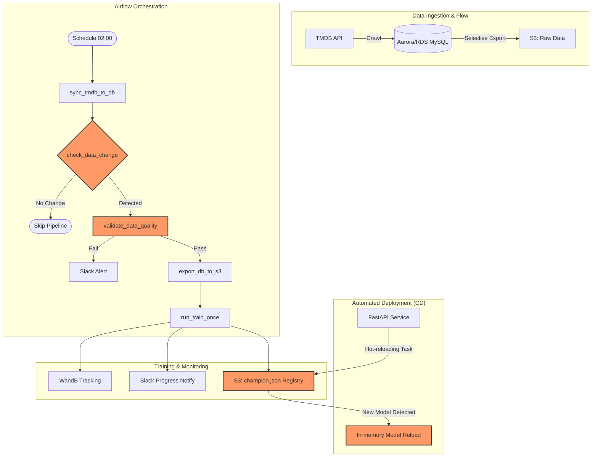

# TMDB Rating MLOps Pipeline Enhancement

한국 영화 데이터를 활용한 영화 평점 예측 서비스의 안정성과 효율성을 극대화하기 위해 구축된 **고도화된 MLOps 파이프라인** 프로젝트입니다. 기존의 단순한 학습 흐름을 넘어서, 데이터 무결성 검증, 조건부 학습, 실시간 알림 및 무중단 배포(CD) 체계를 통합하였습니다.

## 1. Pipeline Architecture

## 2. 주요 구현 내용 (Feature Details)

### 1) 데이터 흐름 최적화 (RDS to S3)
*   **Source of Truth 일원화**: 모든 원천 데이터의 기준을 RDS(MySQL)로 고정하고, 학습에 필요한 시점에만 데이터를 S3로 추출하도록 로직을 분리하였습니다.
    - `sync_tmdb_to_db.py`: 데이터 수집 전용.
    - `export_db_to_s3.py`: 데이터 추출 및 데이터 레이크(S3) 업로드 전용.

### 2) 조건부 학습 트리거 (Conditional Training)
*   **리소스 낭비 방지**: 데이터의 실질적인 변화가 감지되었을 때만 학습 파이프라인이 뒤를 잇도록 설계하여 불필요한 컴퓨팅 비용을 절감합니다.
    - `check_data_change.py`: DB의 현재 데이터 건수와 마지막 학습 시점의 건수를 비교.
    - Airflow `ShortCircuitOperator`를 활용해 "변화 없음" 시 이후 단계를 즉시 중단(Skip)합니다.

### 3) 데이터 품질 검증 (Data Quality Gate)
*   **모델 신뢰성 확보**: 오염된 데이터가 학습에 유입되는 것을 원천 차단하기 위해 학습 직전 무결성 검증 단계를 수행합니다.
    - `validate_data_quality.py`: 결측치 비율(10% 미만), 평점 유효 범위(0~10), 주요 필드 음수 값 존재 여부 등을 전수 검증합니다.
    - 기준 미달 시 슬랙 경고를 전송하고 파이프라인을 중단합니다.

### 4) 실시간 알림 서비스 (Slack Notification)
*   **운영 가시성 극대화**: 파이프라인의 생애주기별 상태를 운영팀에 실시간으로 중계합니다.
    - `slack_notifier.py`: 에러 로그, 학습 지표, 품질 검증 결과 등을 포맷팅하여 전송하는 공통 모듈.
    - 파이프라인 시작/성공/실패 메시지를 통해 장애 대응 시간을 단축합니다.

### 5) 배포 자동화 및 실시간 반영 (CD / Hot-reloading)
*   **무중단 서비스 제공**: 새로운 '챔피언' 모델이 탄생하면 API 서버의 재시작 없이 즉시 서비스에 반영되는 Hot-reloading 체계를 구축하였습니다.
    - `predictor.py`: S3 레지스트리(`champion.json`)를 통해 최신 모델 버전 식별 및 로딩.
    - API 서버 백그라운드 태스크가 10분 간격으로 신규 모델을 체크하여 라이브 서비스에 자동 적용합니다.

### 6) 아키텍처 및 운영 자동화
*   **인프라 가시성**: 전체 시스템 구조를 Mermaid 다이어그램으로 시각화하고, 복잡한 MLOps 워크플로우를 문서를 통해 누구나 이해할 수 있도록 표준화하였습니다.

## 3. Tech Stack

- **ML Framework**: PyTorch
- **Orchestration**: Apache Airflow
- **Service**: FastAPI (Dockerized)
- **Data**: AWS Aurora/RDS (MySQL), AWS S3, AWS SQS
- **Experiment Management**: Weights & Biases (W&B)
- **Monitoring**: Slack API
- **Infra/CI/CD**: GitHub Actions, uv
