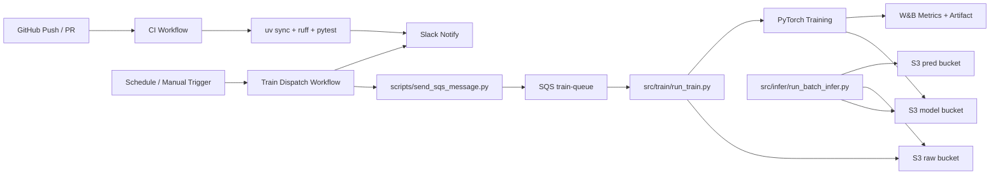

# MLOps Project 아키텍처

## 개요

`mlops_project`는 GitHub Actions 기반 자동화와 AWS(S3/SQS), Python 워커, W&B, Slack 알림으로 구성됩니다.

- CI: 코드 품질 검사(`ruff`, `pytest`)와 결과 알림
- 학습 트리거: 스케줄/수동 실행으로 SQS 학습 메시지 발행
- 학습 워커: S3 데이터 로드, PyTorch 학습, 모델 아티팩트 저장
- 배치 추론: 저장된 모델로 예측 생성 후 S3 업로드

## 시스템 아키텍처

## 실행 경로

### 1) CI 경로

- 트리거: `main` 브랜치 `push`, `pull_request`
- 처리: `uv sync --dev` -> `uv run ruff check .` -> `uv run pytest -q`
- 결과: 공통 `notify.yml`로 Slack 성공/실패 메시지 전송

### 2) 학습 경로

- 트리거: `workflow_dispatch` 또는 `cron(매일 02:00 UTC)`
- 처리:
  - `scripts/send_sqs_message.py`가 학습 파라미터를 SQS에 전송
  - `src/train/run_train.py`가 메시지 수신 후 S3 raw 데이터 학습
  - 모델을 S3 model 버킷(`models/{run_id}/rating_model.pt`)에 업로드
  - W&B에 metric/artifact 기록
- 완료: 처리된 SQS 메시지 삭제

### 3) 배치 추론 경로

- 진입점: `src/infer/run_batch_infer.py`
- 처리:
  - S3 model 버킷에서 모델 다운로드
  - S3 raw 버킷에서 입력 CSV 다운로드
  - 예측 컬럼(`predicted_rating`) 생성
  - 결과를 S3 pred 버킷으로 업로드

## 인프라 의존성

- S3: 단일 버킷을 raw/model/pred 용도로 공유(prefix 분리)
- SQS: `train-queue`를 학습 작업 디스패치 큐로 사용
- Terraform: `infra/`에서 S3/SQS를 생성하고 `terraform output`으로 `.env`와 동기화
