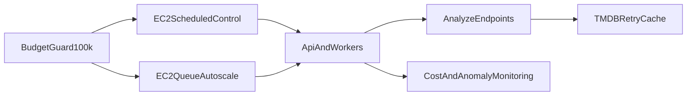

# 3/15 비용-성능 최적화 운영 가이드

## 1) 한 문장 요약

3/15까지 총비용 10만원을 넘기지 않으면서 `/analyze` 기능 성능과 운영 안정성을 함께 유지하는 실행 가이드입니다.

## 2) 쉬운 설명 (Teach)

이 문서는 “돈을 아끼되, 기능은 느려지지 않게” 운영하는 방법입니다.

- 서버는 필요한 시간에만 켭니다.
- 일이 몰릴 때만 워커를 늘립니다.
- API는 캐시와 재시도로 응답을 안정화합니다.
- 비용이 빨리 올라가면 그날 바로 보수 모드로 전환합니다.

핵심 목표는 딱 2개입니다.

1. 3/15까지 누적 비용 `<= 100,000원`
2. `/analyze` 기능 정상 동작과 응답 안정성 유지

## 3) 핵심 구성요소 역할

- `airflow/dags/*`
  - 학습/추론 파이프라인을 3/15까지 스케줄링합니다.
- `.github/workflows/ec2-scheduled-control.yml`
  - 시간 정책으로 EC2를 시작/중지합니다.
- `.github/workflows/ec2-queue-autoscale.yml`
  - 큐 backlog 기준으로 워커를 탄력 운영합니다.
- `.github/workflows/ec2-anomaly-cost-alert.yml`
  - 이상 징후와 비용 리스크를 감시합니다.
- `src/api/tmdb_client.py`
  - TMDB 호출의 세션 재사용/재시도/TTL 캐시로 API 안정성을 높입니다.
- `src/api/main.py`
  - `/analyze`, `/analyze/id` 응답 생성 로직을 처리합니다.

## 4) 헷갈리는 포인트 (Q/A)

Q. 비용 상한 10만원은 일별로 어떻게 관리하나요?  
A. `남은 예산 / 남은 일수`로 일한도를 계산해 매일 재설정합니다.

Q. 기능 최적화는 속도만 보면 되나요?  
A. 아닙니다. 추천 응답 정상률, 동일 요청 일관성, TMDB 장애 시 복구 동작도 같이 봐야 합니다.

Q. 데모 시간에는 어떻게 운영하나요?  
A. 데모 직전 워크플로우를 수동 트리거해 warm-up하고, 종료 직후 scale-in 정책을 복원합니다.

## 5) 다시 단순화한 흐름

## 6) 운영 기준값

- 비용 목표: `2026-03-15`까지 누적 `100,000원` 이하
- 서비스별 시작 가드:
  - EC2 65%
  - S3 15%
  - CloudWatch/로그 10%
  - 기타/버퍼 10%
- 초과 위험 대응 우선순위:
  1. infer scale-out 임계값 상향
  2. 유휴 인스턴스 scale-in 강화
  3. 비핵심 워크플로우 수동 전환

## 7) 데일리 점검 체크리스트

- [ ] 오전: 워크플로우 활성/최근 schedule 성공 여부 확인
- [ ] 오전: EC2 상태가 정책 시간대와 일치하는지 확인
- [ ] 오후: 큐 backlog/DLQ 유입 점검
- [ ] 오후: `/analyze` p95, 5xx, TMDB 호출량 점검
- [ ] 마감: 누적 비용 편차 확인 후 다음날 `normal`/`cost-safe` 모드 결정

## 8) 원본 계획 문서

- 원본: `.cursor/plans/3월15일_안정운영_전략_1d64906e.plan.md`

