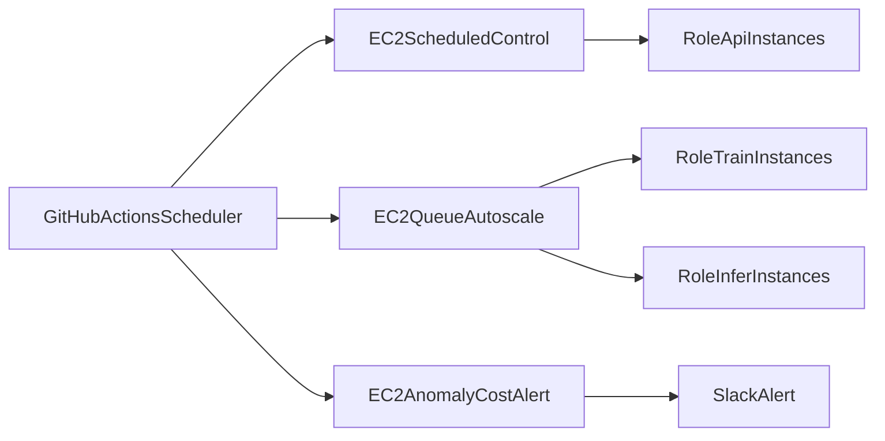

# EC2 비용최적화 운영 가이드 (학습/추론 병행)

## 1) 한 문장 요약

EC2를 `role` 기반으로 분리하고, 큐 길이와 저사용 지표를 함께 써서 필요한 순간에만 켜는 운영 방식입니다.

## 2) 쉬운 설명 (Teach)

이 프로젝트는 학습과 추론이 항상 바쁘지 않습니다.  
그래서 서버를 하루 종일 켜두면 돈이 낭비됩니다.

핵심은 간단합니다.

- API 서버는 꼭 필요한 시간만 켭니다.
- 학습/추론 워커는 큐에 일이 들어왔을 때만 켭니다.
- 너무 한가한 서버는 자동으로 "중지 후보"로 잡아냅니다.
- 반드시 켜둬야 하는 서버는 `keep_alive=true` 태그로 보호합니다.

## 3) 핵심 구성요소 역할

- `config/ec2_schedule_targets.csv`
  - 스케줄 제어 대상, 역할, 운영시간, `keep_alive` 정책을 정의합니다.
- `.github/workflows/ec2-scheduled-control.yml`
  - 평일 매시 실행되어 role별 시작/중지 시간 정책을 적용합니다.
- `.github/workflows/ec2-queue-autoscale.yml`
  - SQS backlog로 `train`/`infer` 워커를 자동 시작/중지합니다.
- `.github/workflows/ec2-anomaly-cost-alert.yml`
  - 24시간 평균 CPU/Network/Disk 기준으로 저사용 인스턴스를 탐지합니다.

## 4) 운영 흐름

## 5) 태그 정책 표준

모든 EC2 인스턴스에 아래 태그를 유지합니다.

- `Name`: 인스턴스 식별 이름
- `role`: `api` | `train` | `infer`
- `env`: `prod` (필요 시 `dev`, `stg` 추가)
- `keep_alive`: `true` | `false`

`keep_alive=true`는 자동 중지에서 제외됩니다.

## 6) 스케줄 정책 표준

- API(`role=api`): 평일 `09:00~24:00(KST)` 기본 운영
- 학습/추론 워커(`train`, `infer`): 스케줄 상시는 최소화, 큐 이벤트 중심 운영
- 수동 예외: `ec2-scheduled-control.yml`의 `workflow_dispatch(action=start|stop)` 사용

## 7) SQS 기반 오토스케일 정책

- scale-out: backlog가 임계치 이상이면 stopped 워커를 start
- scale-in: backlog가 0이고 최근 N분 CPU가 임계치 이하이면 stop
- 기본 임계치(Repository Variables)
  - `TRAIN_QUEUE_SCALE_OUT_THRESHOLD` (기본 1)
  - `INFER_QUEUE_SCALE_OUT_THRESHOLD` (기본 1)
  - `QUEUE_SCALE_IN_IDLE_MINUTES` (기본 20)
  - `QUEUE_IDLE_CPU_THRESHOLD` (기본 3)

## 8) Spot 전환 및 중단 대응 전략

학습/배치 워커는 Spot 우선으로 운영합니다.

- 대상: `role=train`, `role=infer`
- 원칙:
  - 중단 내성 있는 배치성 작업만 Spot으로 이동
  - API(`role=api`)는 온디맨드 우선

중단 대응(재시도) 정책:

1. 작업 단위를 SQS 메시지로 분리해 재처리 가능 상태 유지
2. 워커는 처리 성공 시에만 메시지 삭제
3. 중단/실패 시 visibility timeout 이후 자동 재수신
4. 반복 실패 메시지는 DLQ로 격리

## 9) 관측/알림 정책

저사용 후보 기준(기본값):

- `EC2_IDLE_LOOKBACK_HOURS=24`
- `EC2_IDLE_CPU_THRESHOLD=3`
- `EC2_IDLE_NETWORK_BPS_THRESHOLD=50000`
- `EC2_IDLE_DISK_BPS_THRESHOLD=50000`

알림:

- 이상 징후(고CPU/헬스체크/디스크): Slack + SNS
- 저사용 후보: Slack + SNS

## 10) 점검 체크리스트

- [ ] 대상 인스턴스에 `role/env/keep_alive` 태그가 설정되어 있는가
- [ ] `config/ec2_schedule_targets.csv`의 운영시간이 실제 정책과 일치하는가
- [ ] `TRAIN_QUEUE_URL`, `INFER_QUEUE_URL` 시크릿이 설정되어 있는가
- [ ] 큐 비어있음 + 저CPU에서 워커가 자동 중지되는가
- [ ] `keep_alive=true` 인스턴스가 자동 stop에서 제외되는가
