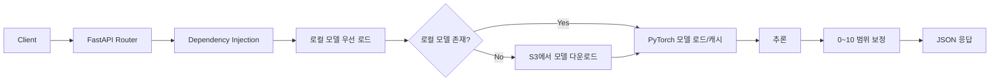

# FastAPI 서빙 구조 가이드

## 목적

`mlops_project`의 기존 학습/아티팩트(S3) 파이프라인을 재사용하면서 온라인 예측 API를 제공하기 위한 구조를 정의한다.

## API 흐름



## 예측 호출 전 필수 체크

`/predict`, `/predict/batch` 호출 전 아래 값이 필요하다.

- `API_LOCAL_MODEL_PATH` (권장): 컨테이너/로컬의 모델 파일 경로
- `API_MODEL_S3_KEY` (옵션): 로컬 모델이 없을 때 사용할 모델 S3 키
- `AWS_S3_MODEL_BUCKET` (옵션): 모델 버킷 이름
- `AWS_ACCESS_KEY_ID`, `AWS_SECRET_ACCESS_KEY`, `AWS_REGION` (옵션): S3 접근 권한

예시:

```bash
API_LOCAL_MODEL_PATH=/app/models/rating_model.pt
API_MODEL_S3_KEY=models/<wandb_run_id>/rating_model.pt
```

누락 시 API는 `500` 대신 `503`과 함께 안내 메시지를 반환한다.

## Docker로 실행

API 이미지(`api-runtime`)에는 `models/rating_model.pt`가 포함되며, 기본적으로
`API_LOCAL_MODEL_PATH=/app/models/rating_model.pt`를 사용해 로컬 모델을 먼저 로드한다.
로컬 모델이 없을 때만 S3 다운로드 경로(`API_MODEL_S3_KEY`)를 사용한다.

### API 컨테이너만 실행

```bash
docker compose up -d --build api
docker compose logs -f api
```

### API 개발 모드(저장 시 자동 반영)

```bash
docker compose up -d --build api-dev
docker compose logs -f api-dev
```

- `api-dev`는 `./src`를 컨테이너 `/app/src`에 마운트하고 `uvicorn --reload`로 실행한다.
- 코드 저장 후 브라우저 새로고침 시 변경사항이 바로 반영된다.

### API + 학습 워커 함께 실행

```bash
docker compose up -d --build
docker compose logs -f api
docker compose logs -f trainer-worker
```

### 중지

```bash
docker compose down
```

## 저장 후 반영이 안 될 때 체크

1. `api` 대신 `api-dev`(또는 로컬 `--reload`)로 실행했는지 확인
2. 동일 포트(8000)를 다른 프로세스가 점유 중인지 확인
3. 브라우저 강력 새로고침 후 `/openapi.json` 내용 갱신 확인

## 엔드포인트

- `GET /health`: 서버 상태 확인
- `POST /predict`: 단건 예측
- `POST /predict/batch`: 다건 예측

### 1) `GET /health`

#### health 설명

- API 서버 프로세스 상태를 확인한다.
- 로드밸런서/모니터링의 기본 헬스체크 엔드포인트로 사용할 수 있다.

#### health 사용법

```bash
curl http://localhost:8000/health
```

#### health 응답 예시

```json
{
  "status": "ok"
}
```

### 2) `POST /predict`

#### predict 설명

- 단일 영화 메타데이터를 입력받아 예측 평점을 반환한다.
- 입력 값 검증 실패 시 `422 Unprocessable Entity`를 반환한다.
- 모델 로드 실패 시 `503 Service Unavailable`를 반환한다.
- 응답 평점은 `0~10` 범위로 보정된다.

#### predict 요청 필드

- `budget` (number, `>= 0`): 영화 제작비(USD)
- `runtime` (number, `> 0`): 러닝타임(분)
- `popularity` (number, `>= 0`): TMDB 인기도 점수
- `vote_count` (number, `>= 0`): TMDB 투표 수

#### predict 사용법

```bash
curl -X POST http://localhost:8000/predict \
  -H "Content-Type: application/json" \
  -d '{"budget": 100000000, "runtime": 120, "popularity": 25.5, "vote_count": 5000}'
```

### 3) `POST /predict/batch`

#### batch 설명

- 여러 영화 메타데이터를 한 번에 예측한다.
- 응답 `predictions` 배열의 순서는 요청 `items` 순서와 동일하다.
- 각 평점 값은 `0~10` 범위로 보정된다.

#### batch 요청 필드

- `items` (array, `minLength=1`): `POST /predict`의 요청 객체 배열

#### batch 사용법

```bash
curl -X POST http://localhost:8000/predict/batch \
  -H "Content-Type: application/json" \
  -d '{
    "items": [
      {"budget": 100000000, "runtime": 120, "popularity": 25.5, "vote_count": 5000},
      {"budget": 50000000, "runtime": 95, "popularity": 12.1, "vote_count": 1300}
    ]
  }'
```
