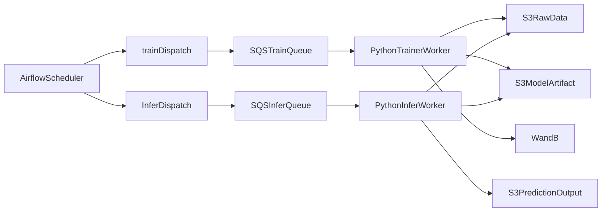

# MLOps 파이프라인 한눈에 이해하기

## 1) 한 문장 요약

이 프로젝트는 `Airflow`가 `SQS`에 작업을 넣고, Python 워커가 `S3` 데이터를 사용해 학습/추론을 수행한 뒤 결과를 `S3`와 `W&B`에 기록하는 자동화 파이프라인입니다.

## 2) 쉬운 설명

이 시스템을 "주문 처리 공장"으로 보면 쉽습니다.

- `Airflow`는 주문서를 넣는 접수 창구입니다.
- `SQS`는 주문서를 잠시 쌓아두는 대기함입니다.
- `trainer-worker`, `infer-worker`는 실제 작업자입니다.
- `S3`는 원자재와 완성품 창고입니다.
- `W&B`는 실험 노트와 성적표입니다.

즉, "접수 -> 대기 -> 작업 -> 기록"이 반복되는 구조입니다.

## 3) 핵심 구성요소 역할

- `mlops_project/airflow/dags/mlops_train_pipeline.py`
  - 학습 트리거와 품질 게이트 후보 선별을 스케줄 실행합니다.
- `mlops_project/airflow/dags/mlops_infer_pipeline.py`
  - 배치 추론 트리거를 스케줄 실행합니다.
- `mlops_project/src/train/run_train.py`
  - 큐 메시지를 읽고 학습한 후 모델 아티팩트를 `S3`와 `W&B`에 기록합니다.
- `mlops_project/src/infer/run_infer_worker.py`
  - 추론 메시지를 읽고 배치 예측 결과를 `S3`에 저장합니다.
- `mlops_project/scripts/register_model.py`
  - W&B 지표(`val_rmse`, `val_out_of_range_ratio`) 기반 품질 게이트 후보를 산출합니다.

## 4) 헷갈리는 포인트 (Q/A)

**Q1. 학습 트리거는 무엇이 담당하나요?**  
A1. 학습/배치추론 트리거는 Airflow DAG가 담당하고, CI는 GitHub Actions가 담당합니다.

**Q2. 학습은 누가 시작하나요?**  
A2. 직접 학습 코드를 바로 실행하지 않고, 먼저 `SQS`에 메시지를 넣고 워커가 그 메시지를 받아 시작합니다.

**Q3. 모델 파일은 어디에 저장되나요?**  
A3. 학습 완료 후 `S3 model` 경로(`models/<run_id>/rating_model.pt`)에 저장됩니다.

**Q4. 품질 게이트는 배포를 바로 막나요?**  
A4. 현재 MVP에서는 W&B run 중 기준을 통과한 후보를 선별해 `artifacts/model_registry_candidate.json`를 생성하는 단계입니다.

**Q5. 배치 추론과 API 추론은 같은 모델을 쓰나요?**  
A5. 같은 체크포인트 포맷을 기준으로 사용하며, 배치 추론은 `S3` 입력/출력을 중심으로 동작합니다.

## 5) 다시 단순화한 흐름

1. `Airflow`가 작업 메시지를 `SQS`에 보냅니다.
2. `trainer-worker`/`infer-worker`가 메시지를 받아 작업을 시작합니다.
3. 학습 워커는 `S3 raw` 데이터로 모델을 학습합니다.
4. 결과 모델은 `S3 model`에 저장되고, 지표/아티팩트는 `W&B`에 기록됩니다.
5. 추론 워커는 모델과 입력 데이터를 읽어 예측 결과를 `S3 pred`에 저장합니다.

## 6) 점검 체크리스트

- `.env`에 `TRAIN_QUEUE_URL`, `INFER_QUEUE_URL`, `AWS_`*, `WANDB_*`가 설정되어 있다.
- `docker compose up -d`로 `trainer-worker`, `infer-worker`, `api`가 실행된다.
- `docker compose -f docker-compose.airflow.yml up -d`로 Airflow(`webserver`, `scheduler`)가 실행된다.
- Airflow UI(`http://localhost:8085`)에서 `mlops_train_pipeline`, `mlops_infer_pipeline` DAG가 보인다.
- 학습 메시지 전송 후 `S3 model`에 모델 파일이 올라간다.
- 배치 추론 메시지 전송 후 `S3 pred`에 결과 CSV가 올라간다.

