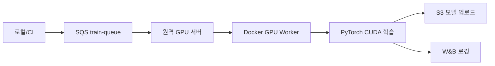

# 원격 서버 GPU 학습 가이드

TMDB 평점 예측 모델을 원격 GPU 서버에서 학습하는 방법입니다.

## 아키텍처



## 사전 요구사항

- 원격 서버: Docker 및 NVIDIA Container Toolkit 설치 필요
- 연결 정보는 `remote.env`에 설정 (GitHub에 업로드되지 않음)

## 0. 원격 서버 연결 정보 설정

```bash
cp remote.env.example remote.env
# remote.env를 편집하여 실제 호스트, 포트, SSH 키 경로 입력
```

## 1. 원격 서버 NVIDIA 환경 확인

```bash
# remote.env 로드 후
source remote.env
ssh -i $SSH_KEY -p $REMOTE_PORT $REMOTE_USER@$REMOTE_HOST
nvidia-smi
docker run --rm --gpus all nvidia/cuda:12.4.0-base-ubuntu22.04 nvidia-smi
```

## 2. 배포 스크립트 실행

로컬 `mlops_project` 디렉터리에서 (`remote.env` 필수):

```bash
chmod +x scripts/deploy_remote.sh
./scripts/deploy_remote.sh
```

이 스크립트는:

1. GPU Docker 이미지 빌드
2. 이미지를 tar로 저장
3. 원격 서버로 SCP 전송
4. 원격 서버에서 `docker load` 실행

## 3. 환경변수(.env) 복사

배포 스크립트 완료 시 출력되는 scp 명령어를 사용하세요. (remote.env 기반)

## 4. 원격 서버에서 학습 워커 실행

```bash
# SSH 접속 (remote.env의 연결 정보 사용)
ssh -i $SSH_KEY -p $REMOTE_PORT $REMOTE_USER@$REMOTE_HOST
docker run --gpus all --rm --env-file .env mlops-trainer-gpu:latest
```

또는 docker-compose 사용:

```bash
docker compose -f docker-compose.gpu.yml up -d
docker compose -f docker-compose.gpu.yml logs -f trainer-worker-gpu
```

## 5. 학습 트리거

GitHub Actions의 `train-dispatch.yml`을 수동 실행하거나, 로컬에서 SQS 메시지 전송:

```bash
uv run python scripts/send_sqs_message.py
# 배치 추론 메시지 전송
uv run python scripts/send_infer_sqs_message.py
```

SQS 메시지가 `train-queue`에 들어가면, 원격 서버의 GPU 워커가 메시지를 수신하고 학습을 시작합니다.

## 트러블슈팅

| 문제 | 해결 |
| ------ | ------ |
| `nvidia-smi` 없음 | NVIDIA 드라이버 설치 |
| `could not select device driver` | nvidia-container-toolkit 설치 |
| CUDA out of memory | `batch_size` 줄이기 (SQS payload에서 조정) |
| SQS 메시지 수신 안 됨 | `.env`의 `TRAIN_QUEUE_URL`, AWS 자격증명 확인 |
